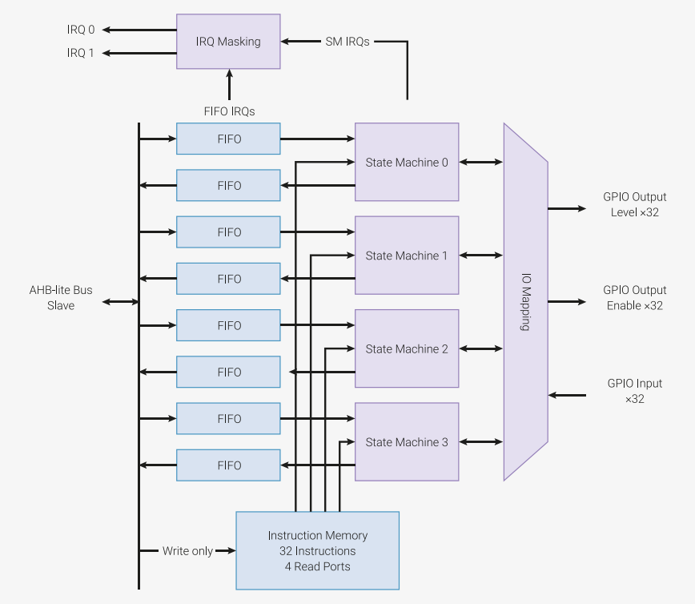
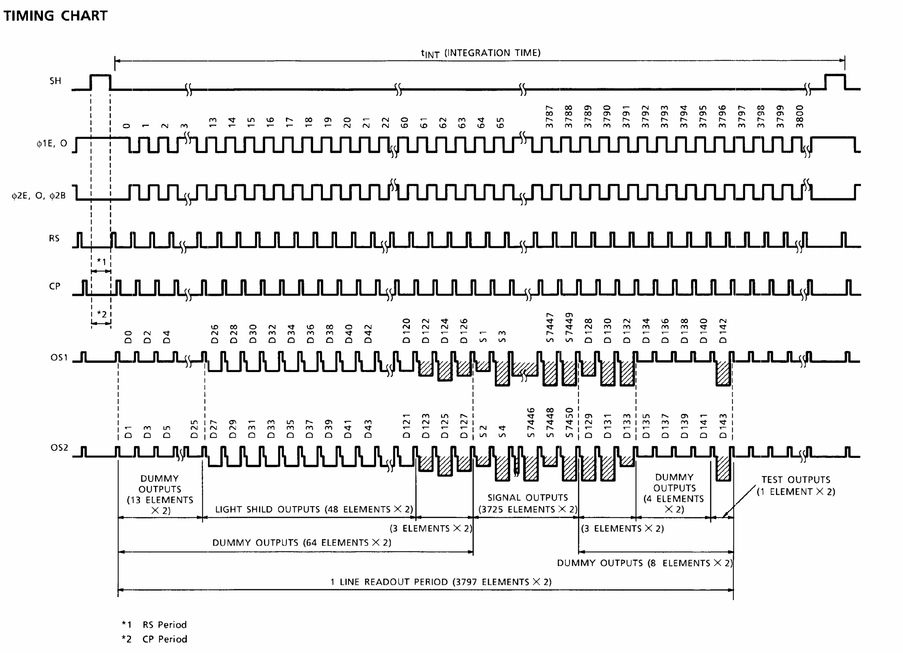
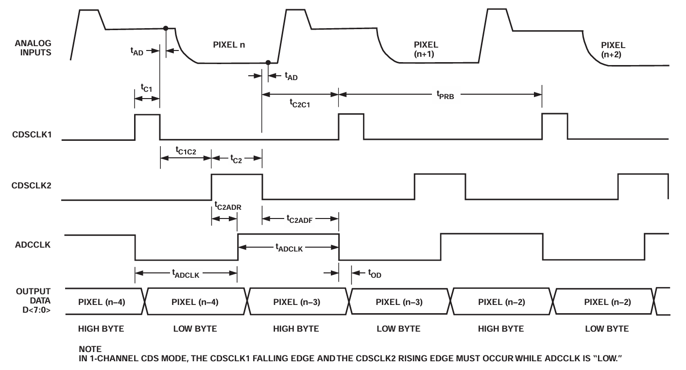
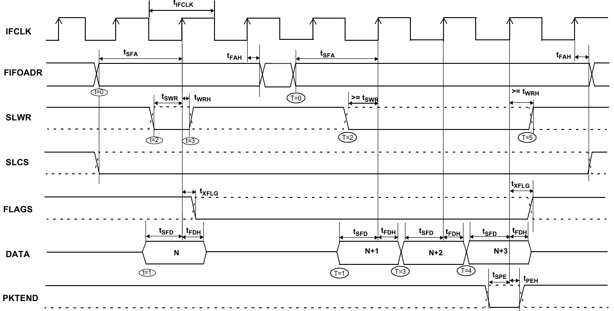

# Project PRISM RP2040 Firmware

This folder contains the code used to build the firmware for the RP2040 timing generator.

Instead of writing only a basic build guide, this README also records how the firmware is designed and shares some practical experience with RP2040 PIO programming.

## Replication Guide

1. Install VSCode
2. Install `Raspberry Pi Pico` extension
3. Click the `Pi Pico` icon, then `Run Project (USB)`, and you're good to go!

## Control Topology

In the current architecture, this RP2040 firmware is the Scanner Main Control Board's PC-facing control endpoint.

- **PC -> Scanner Main Control Board**: USB vendor interface (`A5/5A` framed protocol)
- **Scanner Main Control Board -> Peripheral Control Board**: UART0 on GPIO28/GPIO29 (`A6/6A` framed subordinate protocol)

That means the Scanner Main Control Board owns the stable host-facing USB API. Peripheral-board details stay behind the board-to-board UART link, while the public control surface is grouped by scanner capability domains such as illumination and motion. A dedicated debug passthrough command still exists when raw subordinate access is needed.

## Introduction

Existing open-source high-performance CCD camera projects usually use FPGAs to generate clock signals for the CCD and A/D converters ([CameraNexus/Sitna1](https://github.com/CameraNexus/sitina1), 2025; [BellssGit/ICX453_CCD_Mirrorless_Camera](https://github.com/BellssGit/ICX453_CCD_Mirrorless_Camera), 2025). The benefits are clear: many available GPIOs, precise timing control, and fast custom logic such as the intensity histograms demonstrated in those projects. However, FPGAs also have several noticeable weaknesses: price, power consumption, and development difficulty.

Therefore, most projects, especially linear CCD projects, still rely on MCUs or USB chips as timing generators ([smr547/cam86](https://github.com/smr547/cam86), 2016; [divertingPan/Line_Scan_Camera](https://github.com/divertingPan/Line_Scan_Camera), 2021; [openlux/openlux-v1](https://github.com/openlux/openlux-v1), 2022; [drmcnelson/TCD1304-Sensor-Device-with-Linear-Response-and-16-Bit-Differential-ADC](https://github.com/drmcnelson/TCD1304-Sensor-Device-with-Linear-Response-and-16-Bit-Differential-ADC), 2025). Although easier to develop, most of these projects are limited by the MCU itself, or by how the MCU can generate the required clock signals, and only reach readout speeds of about 0.5-3 million pixels per second (MSPS).

The release of the RP2040 changed the game. The RP2040, and later the RP2350, include a unique peripheral called Programmable I/O (PIO), which allows IO pins to be controlled with exact system-clock timing. Thanks to this feature, the chip was quickly adopted in a wide range of applications, especially in game-console modding. In this project, by using PIO, we are able to push the system pixel rate up to 20 MSPS without an FPGA.

## Methodology

### Overview of PIO in RP2040
Each RP2040 has 2 PIO peripherals, and each PIO contains 4 State Machines (SMs). Each PIO has its own 32-slot instruction memory shared by its 4 SMs. Each SM also has its own 4x32-bit TX/RX FIFO, which can be merged into an 8x32-bit FIFO when only TX or RX is needed.



When enabled, each SM executes 1 instruction per clock cycle in parallel with the others, unless it is stalled. The clock speed of each SM can be adjusted independently using a clock divider. An SM may control up to 10 IOs: 5 regular pins, which require `SET` instructions and consume instruction cycles, and 5 side-set pins, which can be changed alongside another instruction in the same cycle.

### State Machines in Project PRISM

In this project, we need to generate clock signals for the TCD1708 CCD, 2 AD9826 ADCs, and the CY7C68013A acting as the ADC FIFO buffer. To do that, we use all 4 SMs in `PIO0`. The details are shown in the table below:

| SM# | Pin Assignments | Function Description                                                                                     | Instruction Length |
| --- | --------------- | -------------------------------------------------------------------------------------------------------- | ------------------ |
| 0   | 0-5             | Generates CCD clocks (SH, φ1, φ2, φ2B, RS, CP), sync to CY7C68013A's IFCLK                               | 15                 |
| 1   | 12-18           | Generates ADC1/2 clocks (ADCCLK, CDSCLK2, CDSCLK1), as well as an exposure sync signal, sync to CCD clock | 8                  |
| 2   | 19-22           | Generates SLWR/PKTEND signal for CY7C68013A, keeps SLCS low, sync to CCD clock                           | 7                  |
| 3   | 20              | Generates an always-on IFCLK clock for CY7C68013A                                                        | 2                  |

Instead of assigning 1 SM per chip, we use SM1 to generate clocks for both ADCs because their timing is identical. This also saves 1 SM for generating `IFCLK` for the CY7C68013A USB FIFO buffer in synchronous mode.

#### SM0
```asm
.program line_sig_generate
.side_set 1
.wrap_target
line_sig_init:                                  ; 54321(0) <- GPIO 5-0
    set pins, 0b01001       [1]     side 0      ; HHLLH(L), RS high CP low (16ns)
    set pins, 0b10001       [1]     side 0      ; HLLLH(L), RS low CP high (16ns)
    set pins, 0b00001       [15]    side 0      ; ┌ LLLLH(L), RW/CP low (128ns)
    out x, 16               [8]     side 0      ; | LLLLH(L), SH low (72ns)   Load & controls exposure time, as well as enable of exposure
exp_ticks_loop:                                 ; |
    jmp x-- exp_ticks_loop  [5]     side 0      ; | LLLLH(L), SH low (48ns)*(x+1)
                                                ; └-> >= 200ns in total (t18)
    out x, 4                [0]     side 0      ;   LLLLH(L), x=11
sh_high_loop:                                   ; ┌
    jmp x-- sh_high_loop    [11]    side 1      ; | LLLLH(H), SH high (96ns*12=1152ns)
                                                ; └-> 1000ns <= && <= 5000ns in total (t3)
    out x, 12               [15]    side 0      ; ┌ LLLLH(L), SH low, Load counter value=3800 (128ns)
    irq wait  5             [14]    side 0      ; |  Sync with FIFO clk (120ns)    # only need 1 cycle delay, another 1 hidden before wareup. See readme
                                                ; └-> >= 200ns in total (t19)
    irq clear 4             [0]     side 0      ; -2 clear IRQ4, for state machine syncing (expected 16ns, -8ns for MOSFET delay)
line_sig_loop:
    set pins, 0b11110       [1]     side 0      ; 0  S0 - LHHHL(L), RS high CP high (16ns)
                                                ; 1
    set pins, 0b10110       [0]     side 0      ; 2  S1 - LLHHL(L), RS low CP high (8ns)
    set pins, 0b00110       [2]     side 0      ; 3  S2 - LLHHL(L), RS/CP low, ready for refence sample (8ns)
                                                ; 4
                                                ; 5
    set pins, 0b00001       [3]     side 0      ; 6  S3 - LLLLH(L), CLK2B low, enable signal output, sample pixel after 20ns (32ns) 
                                                ; 7
                                                ; 8
                                                ; 9
    jmp x-- line_sig_loop   [1]     side 0      ; 10 S4 - LLLLH(L), jump to sig_out_loop_clock (16ns)
                                                ; 11
.wrap
```

The SM0 program can be divided into 2 parts: the line-preparation stage and the pixel-loop stage. In the line-preparation stage, we mostly follow the TCD1708D timing chart, with several small workarounds:

- The low 16 bits in each SM0 FIFO word, called `Exposure ticks` in our code, control the pre-`SH` integration delay before the sensor enters the fixed `SH` pulse. We read the value into register `x` each line, so exposure time is adjustable in units of 12 SM clocks. The program then loops with the `jmp` command until enough delay has passed. `Exposure ticks` now allows `0`, which gives the minimum integration delay.
- Then we read 4 bits into register `x` for a fixed 144-clocks `SH` period, where `x` is fixed to 11.
- Finally, we read the upper 12 bits of each SM0 FIFO word into register `x`, which controls the number of loops in the later pixel-clock stage. This value is fixed at 3800; see the TCD1708D datasheet.

The later pixel-loop stage is a sequence of regular IO updates, plus another `jmp` command that determines whether to continue pixel clocks or return to line preparation. For each pixel loop, states 0, 1, 2, and 4 each have a 1-clock delay after 1 instruction clock, while state 3 has a 3-clock delay, for a total of 12 SM clocks per pixel.



#### SM1
```asm
.program cds_line_generate
.side_set 3
.wrap_target
cds_line_init:
    set pins 0b1000         [0] side 0b000      ;       Exposure Sync
    out x, 32               [0] side 0b000      ;       Load counter value=3800
    irq wait 4              [2] side 0b000      ;       State machine syncing. Set IRQ4 and wait for clear, then wait 1 cycle for loop t=0
                                                ; 0     Detects IRQ clear, exit stall state
                                                ; 1   
cds_pixel_loop:                                 ;       GPIO 15-12/18-16
    set pins 0b0100         [2] side 0b100      ; 2     S0 - HLL, CLK low, CDSCLK2 low, CDSCLK1 high, LSB out
                                                ; 3
                                                ; 4
    set pins 0b0010         [2] side 0b010      ; 5     S1 - LHL, CLK low, CDSCLK2 high, CDSCLK1 low, sampleing reference in 2ns
                                                ; 6
                                                ; 7
    set pins 0b0011         [1] side 0b011      ; 8     S2 - LHH, CLK high, CDSCLK2 high, CDSCLK1 low, MSB out
                                                ; 9
    set pins 0b0001         [1] side 0b001      ; 10    S3 - LLH, CLK high, CDSCLK2 low, CDSCLK1 high, sampleing signal in 2ns
                                                ; 11
    jmp x-- cds_pixel_loop  [1] side 0b001      ; 0     S4 - LLH, Check whether to continue pixel loop
                                                ; 1
.wrap
```

SM1 controls the clock signals for both ADCs, which are configured in 1-channel CDS mode after power-up. Similar to SM0, this program is mostly a direct implementation of the timing chart below. We also read one value from the FIFO into `x` for each row so we can control the number of pixel loops. The value is fixed at the same 3800 used by SM0.



#### SM2
```asm
.program fifo_line_generate_sync
.side_set 3
.wrap_target
fifo_line_sync_init:
    out y, 16                   [0] side 0b101   ;          SLWR high, PKTEND high
    irq wait 4                  [3] side 0b111   ;          CLK Generation in idle                  CLK LHHH
                                                 ; 0
                                                 ; 1
                                                 ; 2
    out x, 16                   [2] side 0b100   ; 3        Load counter value=3801*2-1=7601, LLH SLWR low, prepare for bus sample     CLK LLL
                                                 ; 4
                                                 ; 5
fifo_line_sync_loop:                             ;       GPIO 19(20)21
    nop                         [2] side 0b110   ; 6    0   S0 - HHL CLK rising, sample bus data    CLK HHH
                                                 ; 7    1       
                                                 ; 8    2     
    jmp x-- fifo_line_sync_loop [2] side 0b100   ; 9    3   S1 - HLL CLK falling                    CLK LLL
                                                 ; 10   4     
                                                 ; 11   5     
fifo_line_sync_end:
    jmp !y fifo_line_sync_init  [2] side 0b110   ;                                                  CLK HHH
    nop                         [3] side 0b001   ;          PKTEND low CLK rising, execute flush    CLK LLLH
.wrap
```

The SM2 program reads two 16-bit values into registers `y` and `x` separately for each row. Register `x` works as the pixel-loop counter, like in SM0 and SM1, but its value is 7601 (`3801*2-1`) instead of 3800 because the ADCs sample the CCD outputs into 16-bit values. Register `y` is used as an indicator for manual packet send. The USB buffer is configured to send a packet every 512 bytes, but our ADCs produce 15206 bytes per row (7603 words: 7602 row words plus an extra 2 bytes when exiting the pixel loop, because we do not have enough time to pull `SLWR` high), which is not divisible by 512. Therefore, we use this indicator to send the extra bytes whenever we want to end a transaction.

You may have also noticed that SM2 logically drives `SLWR` and `PKTEND`, but it is configured over the continuous pin range GPIO19-22. In the side-set field, bit 0 is `SLWR`, bit 1 is GPIO20, and bit 2 is `PKTEND`; meanwhile, GPIO22 is included in the SM pin range and kept low as the unused `SLCS`. This is because PIO SMs only support continuous pin ranges, so pin 20 has to be included even though `IFCLK` is actually driven by SM3. In fact, this is a hardware-routing mistake: pin 19 and pin 20, `SLWR` and `IFCLK`, should have swapped positions in the circuit design. Later, we found that the board still worked, and we also needed another SM for a freely running `IFCLK`, so the design was kept as-is.



#### SM3
```asm
.program ifclk_generate
.side_set 1
.wrap_target
    irq clear 5             [2] side 1  ; Sync with SMs
    nop                     [2] side 0
.wrap
```

SM3 is loaded with a simple program that toggles pin 20 to generate `IFCLK`.


### In Syncing the State Machines

You may have noticed that there are `irq clear` and `irq wait` instructions in all SMs. These instructions are what keep the state machines in sync. This has been the hardest part of the imaging-subsystem development so far, and it took weeks to get working reliably.

First, a short explanation of these two instructions:
- `irq clear`: Clears an IRQ flag. Like other instructions, it takes 1 SM clock to execute.
- `irq wait`: Sets an IRQ flag and waits until the flag is cleared. After executing this instruction, the waiting SM checks whether the given IRQ flag has been cleared. If it has, the SM continues to the next instruction on the next SM clock after detecting the clear.

The following table shows how these two instructions work, assuming the SMs run at the same frequency:

| SM Clock | SM0                      | SM1             |
| -------- | ------------------------ | --------------- |
| 0        | **irq wait 4**           | something else… |
| 1        | waiting…                 |                 |
| 2        |                          | **irq clear 4** |
| 3        | ***irq clear detected*** | something else… |
| 4        | continue to instruction… |                 |
| 5        |                          |                 |

In the example above, SM0 sets IRQ flag 4 and enters the wait state at clock 0, and SM1 clears IRQ flag 4 at clock 2. SM0 does not detect that the flag was cleared until clock 3, and instruction execution does not resume until clock 4.

We start with SM0, since it is the base of our timing. In every line-preparation period, SM0 enters the wait state through `irq wait 5` and waits for SM3 to clear it. Once SM3 clears the flag, SM0 continues and then spends 14 clocks in the delayed portion of the `irq wait 5` instruction.

| Absolute CLK# | Pixel CLK# | Relative CLK# | SM0              | SM1 | SM2 | SM3                 |
| ------------- | ---------- | ------------- | ---------------- | --- | --- | ------------------- |
| -18           |            |               | (irq wait 5)     |     |     | irq clear 5, side 1 |
| -17           |            |               | Exit Stall State |     |     | 1                   |
| -16           |            |               | delay 1/14       |     |     | 1                   |
| -15           |            |               | delay 2/14       |     |     | 0                   |
| -14           |            |               | delay 3/14       |     |     | 0                   |

Then, after the 14-clock delay, SM0 runs `irq clear 4` to wake up SM1 and SM2. SM1 and SM2 then begin the delay specified by their `irq wait 4` instructions.

| Absolute CLK# | Pixel CLK# | Relative CLK# | SM0           | SM1              | SM2                 | SM3 |
| ------------- | ---------- | ------------- | ------------- | ---------------- | ------------------- | --- |
| -3            |            |               | delay 14/14   |                  |                     | 0   |
| -2            |            |               | irq clear 4   | (irq wait 4)     | (irq wait 4)        |     |
| -1            |            |               | (MOS delay)   | Exit Stall State | Exit Stall State    |     |
| 0             | 0          | 0             | S0            | delay 1/2        | delay 1/3           | 1   |
| 1             |            | 1             | delay 1       | delay 2/2        | delay 2/3           |     |
| 2             |            | 2             | S1            | S0               | delay 3/3           |     |
| 3             |            | 3             | S2 (ref. out) | delay 1/2        | out x               | 0   |
| 4             |            | 4             | delay 1/2     | delay 1/2        | delay 1/2           |     |
| 5             |            | 5             | delay 2/2     | S1 (ref. sample) | delay 2/2           |     |
| 6             |            | 6             | S3            | delay 1/2        | S0 (ADC bus sample) | 1   |
| 7             |            | 7             | delay 1/3     | delay 2/2        | delay 1/2           |     |
| 8             |            | 8             | delay 2/3     | S2               | delay 1/2           |     |
| 9             |            | 9             | delay 3/3     | delay 1          | S1                  | 0   |
| 10            |            | 10            | S4 (sig. out) | S3 (sig. sample) | delay 1/2           |     |
| 11            |            | 11            | delay 1       | delay 1          | delay 2/2           |     |
| 12            | 1          | 0             | S0            | S4               | S0 (ADC bus sample) | 1   |
| 13            |            | 1             | S1            | delay 1          | delay 1/2           |     |
| 14            |            | 2             | S2            | S0               | delay 2/2           |     |

Here SM0 has an extra `MOS delay`, which is not an actual instruction. It is the approximately 8 ns delay of the UCC27524 MOS driver, and we include it here because it helps the SMs line up in the real hardware.

At that point, the SMs are synchronized and the CCD clocks are generated. The ADC clocks are delayed by 1 clock relative to the CCD clocks in order to sample more stable voltages. The USB FIFO bus sample happens 4 clocks after `ADCCLK` changes, helping ensure that invalid data is not captured.

For the remaining pixel clocks, the sequence is identical to CLK#3-12. After that, the clocks enter the preparation period again. Since the preparation phase of SM0 is much longer than that of SM1 and SM2, we ignore the later states of SM1 and SM2 after the pixel clock ends until they are woken up again.

| Absolute CLK# | Pixel CLK# | Relative CLK# | SM0            | SM1              | SM2                 | SM3 |
| ------------- | ---------- | ------------- | -------------- | ---------------- | ------------------- | --- |
| 45600         | 3800       | 10            | S4 (sig. out)  | S3 (sig. sample) | delay 1/2           | 0   |
| 45601         |            | 11            | delay 1        | delay 1          | delay 2/2           |     |
| 45602         | X          |               | set pins       | S4               | S0 (ADC bus sample) | 1   |
| 45603         |            |               | delay 1        | delay 1          | delay 1/2           |     |
| 45604         |            |               | set pins       | ...              | delay 2/2           |     |
| 45605         |            |               | delay 1        |                  | S1                  | 0   |
| 45606         |            |               | set pins       |                  | delay 1/2           |     |
| 45607         |            |               | delay 1/15     |                  | delay 2/2           |     |
| 45608         |            |               | delay 2/15     |                  | ...                 | 1   |
| ...           |            |               | ...            |                  |                     | ... |
| 45631         |            |               | delay 15/15    |                  |                     | 1   |
| 45632         |            |               | out x          |                  |                     |     |
| 45633         |            |               | delay 1/8      |                  |                     | 0   |
| ...           |            |               | ...            |                  |                     | ... |
| 45641         |            |               | Exposure ticks |                  |                     | 0   |
| ...           |            |               | ...            |                  |                     | ... |
| 45647         |            |               | out x          |                  |                     | 0   |
| 45648         |            |               | delay 6*(x+1)  |                  |                     | 1   |

Here we assume `Exposure ticks` is 0, which gives the minimum pre-`SH` integration delay of `6*(x+1)` clocks. The reason this delay is designed as `6*(x+1)` is that 6 clock cycles make SM3 run one full cycle. We use the available delay in line preparation to align SM0 with SM3, which makes the following instructions much easier to align. After the `Exposure ticks` delay, the `SH` high pulse itself still remains fixed at 1152 ns.

| Absolute CLK# | Pixel CLK# | Relative CLK# | SM0              | SM1              | SM2              | SM3                 |
| ------------- | ---------- | ------------- | ---------------- | ---------------- | ---------------- | ------------------- |
| 45648         |            |               | delay 6*(x+1)    |                  |                  | 1                   |
| ...           |            |               | ...              |                  |                  | ...                 |
| 45791         |            |               | delay 12/12      |                  |                  | 0                   |
| 45792         |            |               | out x            |                  |                  | 1                   |
| 45793         |            |               | delay 1/15       |                  |                  |                     |
| ...           |            |               | ...              |                  |                  | ...                 |
| 45807         |            |               | delay 15/15      |                  |                  | 0                   |
| 45808         |            |               | irq wait 5       |                  |                  |                     |
| 45809         |            |               | Stalled          |                  |                  |                     |
| 45810         |            |               | Stalled          |                  |                  | irq clear 5, side 1 |
| 45811(-17)    |            |               | Exit Stall State |                  |                  |                     |
| 45812(-16)    |            |               | delay 1/14       |                  |                  |                     |
| ...           |            |               | ...              |                  |                  | ...                 |
| 45825(-3)     |            |               | delay 14/14      |                  |                  | 0                   |
| 45826(-2)     |            |               | irq clear 4      | (irq wait 4)     | (irq wait 4)     |                     |
| 45827(-1)     |            |               | (MOS delay)      | Exit Stall State | Exit Stall State |                     |
| 45828(0)      | 0          | 0             | S0               | delay 1/2        | delay 1/3        | 1                   |

After the `SH` delay, we continue into the 15-clock delay on the `jmp` command. After that, we reach `irq wait 5`, set IRQ 5, and wait for SM3 to clear it. The timing of this instruction lands only a few clocks before the next `irq clear 5` from SM3, so SM0 does not wait very long. Once SM0 wakes up, all SMs return to exactly the same state discussed earlier. We can therefore conclude that each scan line takes 45828 clock cycles when `Exposure ticks = 0`.

For a full timing sequence, please check [State Machine Sequence.xlsx](<State Machine Sequence.xlsx>).

### Exposure Time Control

Following the timing tables above, the current settings require 45828 clocks for each scan row when `Exposure ticks = 0`.

These timing numbers assume the default `125MHz` RP2040 system clock. If you store a different `prism.sys_clock_khz` value through the control interface, the firmware reapplies that frequency on boot and the real-time exposure/readout durations scale with the new clock.

Here is a quick lookup table if you want to change the line exposure time.

| exposure ticks | scan row cycles | time per frame (ms) | shutter speed |
| -------------- | --------------- | ------------------- | ------------- |
| 0              | 45828           | 0.366624            | 1/2727.5901   |
| 695            | 49998           | 0.399976            | 1/2500.1500   |
| 2779           | 62502           | 0.500008            | 1/1999.9860   |
| 5383           | 78126           | 0.625               | 1/1600        |
| 9029           | 100002          | 0.800008            | 1/1249.9875   |
| 13195          | 124998          | 0.999976            | 1/1000.0240   |
| 18404          | 156252          | 1.250008            | 1/799.9949    |
| 27084          | 208332          | 1.666648            | 1/600.0067    |
| 34029          | 250002          | 2.000008            | 1/499.998     |
| 57466          | 390624          | 3.124984            | 1/320.0016    |
| 65535          | 439038          | 3.512296            | 1/284.7410    |


### System Clock

The RP2040 can be overclocked fairly easily, and no extra hardware changes are required as long as the clock speed stays at or below 270 MHz. However, pushing the clock too far will break the timing design, and the ADCs may no longer sample the correct voltages. This section is included mainly as a record; overclocking is not recommended for normal use. As the frequency increases, you may need to reduce both ADC offset and gain to keep the system running correctly.

Besides overclocking, underclocking is now also supported. You may reduce the system clock to get longer exposure times.

| clock frequency | exposure ticks | row clock cycles | time per frame (ms) | shutter speed | data rate   |
| --------------- | -------------- | ---------------- | ------------------- | ------------- | ----------- |
| 125Mhz          | 0              | 45828            | 0.366624            | 1/2727.5901   | ~39.52MiB/s |
| 130MHz          | 0              | 45828            | 0.352523            | 1/2836.6937   | ~41.13MiB/s |
| 133MHz          | 0              | 45828            | 0.344571            | 1/2902.1559   | ~42.04MiB/s |

## Conclusion

This project shows that RP2040 can be used as a practical high-speed timing generator for CCD imaging, without relying on an FPGA. By coordinating four PIO state machines, Project PRISM is able to generate CCD, ADC, and USB FIFO timing in a fully synchronized way, reaching up to 20 MSPS in the current design.

The most important takeaway is not only the final speed, but also the method: careful instruction-level timing design, explicit state machine synchronization with IRQs, and leaving enough timing margin for external devices such as MOS drivers, ADCs, and USB FIFO logic. In other words, PIO is powerful enough for this class of problem, but only when the whole signal chain is considered together instead of treating PIO code in isolation.

There are still limitations in the current implementation, especially timing margin at higher clock speeds, hardware pin-assignment compromises, and the lack of more automated verification for long timing sequences. Future work could include cleaner hardware routing, higher-clock validation, and better tooling for timing simulation or visualization.

Even so, this project demonstrates that modern MCUs with deterministic IO peripherals can cover a space that previously felt FPGA-only. I hope this write-up can serve as both a reference for this firmware and a useful example for others working on high-speed sensor timing with RP2040/RP2350.

## Future Work

- Improve PCB pin mapping to remove current routing compromises and reduce dependence on software workarounds.
- Measure image-quality impact, data integrity, and thermal behavior under different clock and exposure settings.
